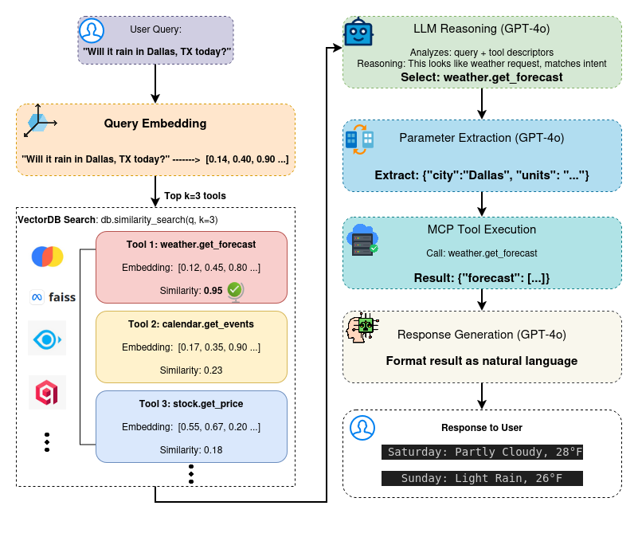

# ToolRAG: Semantic Vector-Based Tool Retrieval for Agentic Systems: A Dynamic Tool Discovery in LLM Agents

  - **Corresponding authors:**  [Theophilus Siameh](https://www.linkedin.com/in/theophilus-siameh-793a8626/), [Abigail Akosua Addobea](https://www.linkedin.com/in/madam-akosua-addobea08/), [Liu Chun-Hung](https://www.ece.msstate.edu/people/faculty/dr-chun-hung-liu/), [Eric Kudjoe Fiah](https://www.linkedin.com/in/eric-fiah-3815b1157/) 

[](https://opensource.org/licenses/MIT) [](https://github.com/zzli2022/System2-Reasoning-LLM)[]()
<!-- 
[](https://arxiv.org/pdf/2502.21321) -->

<!-- <p align="center">
<a href="https://arxiv.org/abs/2503.22342"> </a> 
</p> -->

<p align="center">
    
</p>

## Abstract
Large Language Model (LLM) agents increasingly require dynamic tool discovery and execution capabilities to handle diverse user requests. Traditional approaches hard-code tool mappings or rely on exhaustive function calling, limiting scalability and adaptability. We present a novel framework that decouples tool discovery from execution through semantic vector-based retrieval, storing tool descriptors not executable code in a vector database. Our approach achieves 94.3\% tool selection accuracy on the ToolBench benchmark, outperforming baseline methods by 23.7\%. Through comprehensive ablation studies across 4 embedding models and 8 LLMs (both proprietary and open-source), we demonstrate the framework's robustness and provide mathematical formulations for retrieval optimization. The system reduces tool discovery latency by 67\% compared to exhaustive search while maintaining 99.1\% execution correctness. Our contributions include: (1) a theoretically grounded separation of tool discovery and execution, (2) empirical validation across diverse model architectures and embedding models, (3) a scalable framework supporting $\mathcal{O}(\log n)$ tool retrieval complexity, and (4) open-source implementation with production deployment guidelines.

---

## Architecture



<!-- ## ToolVector: Semantic Vector-Based Tool Retrieval for LLM Agents -->

This project implements an end-to-end **LangGraph-based LLM agent** that:

- Stores **tool descriptors** (not executable code) in a **vector database**
- Uses **semantic search** to retrieve relevant tools
- Uses an **LLM** to reason about which tool to call (with confidence scores)
- Calls tools via **MCP servers** (Model Context Protocol)
- Returns a natural language answer to the user

---

## 1. Installation

### 1.1. Prerequisites

- **Python** ≥ 3.10
- **Git**
- Recommended: **uv** (fast Python package manager) or virtualenv

### 1.2. Clone the repository

```bash
git clone https://github.com/donwany/toolrag.git
cd toolrag   # or the cloned folder name
```

### 1.3. Create environment and install dependencies (uv)

```bash
# Install uv (if not already installed)
curl -LsSf https://astral.sh/uv/install.sh | sh   # macOS / Linux
# or see uv docs for Windows
# Windows (Powershell)
powershell -ExecutionPolicy ByPass -c "irm https://astral.sh/uv/install.ps1 | iex"
# Homebrew
brew install uv

# From project root:
uv init
uv venv
source .venv/bin/activate       # Windows: .venv\Scripts\activate
uv sync                         # installs deps from pyproject.toml / uv.lock

```

Alternatively, with plain `venv` + `pip`:

```bash
python -m venv .venv
source .venv/bin/activate       # Windows: .venv\Scripts\activate
pip install -e .
```

---

## 2. Configuration

### 2.1. Environment file

Copy the example:

```bash
cp .env.example .env
```

Then edit `.env` and set any required values.

Common entries:

```bash
# OpenAI (optional)
OPENAI_API_KEY=sk-...

# Anthropic (optional)
ANTHROPIC_API_KEY=sk-ant-...

# Google Gemini (optional)
GOOGLE_API_KEY=AIzaSy...

# Ollama (local, optional)
OLLAMA_BASE_URL=http://localhost:11434

# MCP servers (used by toolrag agents)
TOOLS_MCP_SERVER_URL=http://127.0.0.1:8000/mcp
SEARCH_MCP_SERVER_URL=http://127.0.0.1:8001/mcp
```

### 2.2. LLM provider selection

The project supports multiple LLM providers via `llm_factory.py`:

- OpenAI
- Anthropic
- Google Gemini
- Ollama (local)

Typical usage:

```python
from llm_factory import get_llm, LLMFactory

# Default provider (see .env)
llm = get_llm()

# Explicit provider
llm = get_llm(provider="anthropic")
llm = get_llm(provider="gemini")
llm = get_llm(provider="ollama")

# Set global default provider
LLMFactory.set_default_provider("anthropic")
llm = get_llm()  # now uses Anthropic
```

### 2.3. Vector store configuration

Vector stores are created via `vector_store_factory.py`. Supported providers:

- `chromadb` (default, persistent local store)
- `faiss`   (in‑memory, fast)
- `milvus`  (production‑grade, scalable)
- `qdrant`  (modern vector DB)

Quick example:

```python
from toolrag.agent import run_agent

# Default (ChromaDB)
result = run_agent("Will it rain in Accra this weekend?")

# Alternative providers
result = run_agent("...", vector_store_provider="faiss")
result = run_agent("...", vector_store_provider="milvus")
result = run_agent("...", vector_store_provider="qdrant")
```

Provider‑specific setup details (ports, Docker, etc.) are described in the `quick-start/VECTOR_STORE_SETUP*` docs; this MAIN file assumes you use the default ChromaDB to start.

---

## 3. MCP Server Setup

Many tools are exposed via **MCP servers**. You must run them before using the MCP‑enabled agents.

From project root:

```bash
# Tools MCP server (weather, calendar, math, data, etc.)
uv run mcp/tools_server.py      # default: http://127.0.0.1:8000/mcp

# Search / arXiv papers MCP server
uv run mcp/search_papers.py     # default: http://127.0.0.1:8001/mcp
```

Ensure the `TOOLS_MCP_SERVER_URL` and `SEARCH_MCP_SERVER_URL` in `.env` match the URLs/ports you use.

---

## 4. Project Structure (high level)

- `src/toolrag/`
  - `cli.py` – main LangGraph agent that:
    - retrieves tools from a vector DB
    - reasons about which tool to call
    - calls the MCP tool
    - validates and generates final response
  - `agent_with_vector_tools.py` – non‑MCP RAG agent (vector DB + tools)
  - `tool_descriptors.py` – descriptors for tools (id, description, inputs, when_to_use, examples)
  - `tool_vectordb.py` – building the tool vector store from descriptors
  - `llm_factory.py`, `embed_factory.py`, `vector_store_factory.py` – shared factories
  - `cli.py`, `__main__.py` – CLI entry points
- `src/tools_data/`
  - `full_tool_descriptors.py` – descriptor set used for evaluation / tooling
- `mcp/`
  - `tools_server.py` – FastMCP tools server
  - `search_papers.py` – MCP server for arXiv paper search
- `evaluation/`
  - `evaluate_agent_mcp.py` – evaluation script for the MCP agent
  - `eval_dataset.json` – evaluation queries + ground truth
  - plotting utilities (e.g. `plot_results_v4.py`)
- `quick-start/`
  - `QUICKSTART.md`, `ARCHITECTURE.md`, `LLM_SETUP.md`, `VECTOR_STORE_SETUP*.md`, etc.

---

## 5. Quick Start (no external keys)

If you just want to see the **agentic flow** without real APIs:

```bash
cd examples
python standalone_demo.py
```

This runs a **mocked** version of the flow:

1. User query → “Will it rain in Accra this weekend?”
2. Vector search → retrieves weather/calendar/stock tools
3. LLM reasoning → picks weather tool
4. “MCP” tool call → mocked weather tool
5. Natural language answer printed to console

This requires only Python (no API keys, no MCP server).

---

## 6. Running the MCP Agent (ToolRAG)

The main MCP‑enabled agent lives in `src/toolrag/cli.py`. It:

- Reads CLI args (query, LLM provider, vector store provider, etc.)
- Builds a `ToolVectorDB` from tool descriptors
- Retrieves top‑k tools by semantic similarity
- Uses an LLM to choose a tool + confidence
- Extracts tool parameters via the LLM
- Calls the matched MCP tool over HTTP
- Validates results, optionally requests user feedback, and then generates the final answer

### 6.1. Minimal run (from project root)

After MCP servers are running:

```bash
uv run python src/toolrag/cli.py \
  --query \"What is the weather in Tokyo?\" \
  --llm_provider ollama
```

All other flags have sensible defaults (vector store, temperatures, thresholds, etc.).

### 6.2. Advanced CLI (full control)

`cli.py` accepts many command‑line arguments (see `src/toolrag/utils.py` / `create_parser`):

- `--query` – user question (required)
- `--llm_provider` – `openai | anthropic | gemini | ollama` (default: `ollama`)
- `--r_temperature` – reasoning LLM temperature (default 0.0)
- `--g_temperature` – generation LLM temperature (default 0.7)
- `--num_tools` – top‑k tools to retrieve from vector DB
- `--confidence_threshold` – min confidence for accepting a tool without user feedback
- `--max_attempts` – max retries for tool selection / refinement
- plus internal state fields (normally left at defaults)

Example:

```bash
uv run python src/toolrag/cli.py \
  --query \"What's the current price of Apple stock?\" \
  --llm_provider openai \
  --vector_store_provider chroma \
  --num_tools 5 \
  --confidence_threshold 0.6 \
  --max_attempts 3

python  src/toolrag/cli.py \
  --query "What is the weather in Tokyo?" \
  --llm_provider ollama \
  --r_temperature 0.0
  --g_temperature 0.7
  --num_tools 3 \
  --confidence_threshold 0.6 \
  --max_attempts 3 \
  --num_tools 3 \ 
  --selected_tool None \
  --failed_tools [] \
  --tool_result None \
  --retrieved_tools [] \
  --tool_execution_success False \
  --tool_confidence 0.0 \ 
  --refined_query "" \
  --requires_user_feedback False \
  --user_feedback None \ 
  --tried_tools_count 0 \
  --messages [] \
  --attempt_count 1 \
  --validation_result "failed" \
  --vector_store_provider qdrant \
  --embedding_provider ollama \
  --embedding_model nomic-embed-text


# using Module
python -m toolrag.cli \             
  --query "what is my ip address and check the weather in Dalllas, TX and search topics on LLM" \
  --vector_store_provider qdrant \
  --num_tools 5 \
  --embedding_model "qwen3-embedding:8b"

uv run -m toolrag.cli \
  --query "what is my ip address and check the weather in Dalllas, TX and search topics on LLM" \
  --vector_store_provider qdrant \
  --num_tools 5 \
  --embedding_model "qwen3-embedding:8b"


# Install CLI
uv pip install -e .

# run CLI
toolrag \
  --query "Im searching for papers on AI Agents" \
  --vector_store_provider milvus \
  --num_tools 3 \
  --embedding_model "qwen3-embedding:8b"

toolrag \
  --query "what is my ip address, check the weather in Dalllas, TX and search for papers on the topic LLM" \
  --vector_store_provider qdrant \
  --num_tools 5 \
  --embedding_model "qwen3-embedding:8b"

toolrag \
  --query "extract paper information with ID: 2406.01698v3" \
  --vector_store_provider qdrant \
  --num_tools 5 \
  --embedding_model "qwen3-embedding:8b"
```

---

## 7. Agent Architecture (Conceptual)

The core flow (LangGraph `StateGraph`) is:

1. **retrieve_tools**  
   - Vector DB search over tool descriptors using embeddings.
   - Returns top‑k tool candidates with scores.

2. **reasoning**  
   - LLM takes the user query + tool descriptions.
   - Chooses one tool id and a confidence score.

3. **tool_execution**  
   - LLM extracts structured parameters for that tool from the query.
   - Matches the tool id to an MCP tool from the connected servers.
   - Calls the MCP tool and records success/failure + result.

4. **validation**  
   - If success and confidence high → go to `response_generation`.
   - If low confidence → route to `user_feedback`.
   - If failed but more tools available → retry with another tool.
   - If attempts left but tools exhausted → refine query / try again.

5. **user_feedback** (interactive mode)  
   - Asks the user to:
     - `confirm` current tool,
     - `select <number>` a different tool,
     - `clarify: <extra context>`, or
     - `new: <new query>`.

6. **response_generation**  
   - LLM generates a natural language answer based on the tool result and/or feedback.

This architecture is detailed visually in `quick-start/ARCHITECTURE.md`.

---

## 8. Evaluation Pipeline

The evaluation framework (in `evaluation/`) measures:

1. **Recall@k** – Fraction of queries where the ground‑truth tool id appears in the top‑k retrieved tools.
2. **Tool Selection Accuracy** – Fraction where the agent’s selected tool matches the ground truth.
3. **End‑to‑End Correctness** – Correct tool selection **and** successful tool execution.
4. **Latency** – End‑to‑end time per query.
5. **Throughput** – Queries per second at the 95th percentile latency.

### 8.1. Running evaluation

From the project root (with MCP servers running):

```bash
# Default dataset (inline), k=1,3,5
uv run python evaluation/evaluate_agent_mcp.py

# Custom dataset JSON
uv run python evaluation/evaluate_agent_mcp.py --dataset evaluation/eval_dataset.json

# Custom k and limit
uv run python evaluation/evaluate_agent_mcp.py --k 1 3 5 10 --limit 5

# Write results to JSON
uv run python evaluation/evaluate_agent_mcp.py --output evaluation/results.json

# Use the curated 10k-style dataset (or any JSON dataset)
uv run python evaluation/evaluate_agent_mcp.py \
  --dataset evaluation/eval_dataset.json \
  --output evaluation/results.json
```

See `evaluation/README_EVAL.md` for sample output and CLI options (`--k`, `--limit`, etc.).

### 8.2. Dataset format

Each entry in `evaluation/eval_dataset.json` has:

```json
{
  "query": "What's the weather in Accra?",
  "ground_truth_tool_id": "get_weather"
}
```

You can generate large, diverse datasets from `src/tools_data/full_tool_descriptors.py` by sampling and paraphrasing the examples and `when_to_use` text.


### 8.3 Output

- Printed summary: Recall@k, Tool Selection Accuracy, End-to-End Correctness, Latency (mean, p95), Throughput (qps @ p95).
- Optional `--output results.json`: full metrics and per-query results.


```
============================================================
EVALUATION RESULTS
============================================================
Queries: 56
  recall@1: 0.7500
  recall@3: 0.8750
  recall@5: 0.9286
  Tool Selection Accuracy:  0.9107
  End-to-End Correctness:   0.9107
  Latency (mean, s):        3.9675
  Latency (p95, s):         7.9621
  Throughput (qps @ p95):   0.1256
============================================================
```

---

## 9. Extending the System with New Tools

Adding a new tool follows three main steps:

1. **Add a descriptor** (to the descriptors list used by `ToolVectorDB`):

```python
# Tool Descriptors
TOOL_DESCRIPTORS = [
  ...
]


my_tool_descriptor = {
    "tool_id": "email_send",
    "description": "Send an email to a recipient",
    "inputs": {
        "to": "email address",
        "subject": "string",
        "body": "string"
    },
    "when_to_use": "User wants to send an email",
    "examples": [
        "Send an email to john@example.com",
        "Email my boss about the meeting"
    ],
}
TOOL_DESCRIPTORS.append(my_tool_descriptor)
```

2. **Expose the executable tool** via the MCP server (e.g. in `mcp/tools_server.py`):

```python
from fastmcp import FastMCP
mcp = FastMCP("UtilityTools")

@mcp.tool()
def email_send(to: str, subject: str, body: str) -> str:
    # Implement your email sending logic here
    return f"Sent email to {to} with subject '{subject}'"
```

3. **Restart the MCP server** and (optionally) refresh the vector DB so the new descriptor is embedded.

From then on, the agent can:

- retrieve `email_send` as a candidate tool for matching queries, and  
- call the underlying MCP implementation automatically.

---

## 10. Development & Contribution

For contributors, see **`CONTRIBUTING.md`**.

### 10.1. Dev setup (summary)

```bash
git clone https://github.com/donwany/toolrag.git
cd toolrag

python -m venv .venv
source .venv/bin/activate
pip install -e .[dev]

make run          # run CLI / basic check
make test         # run tests
make format       # format code
make lint         # run linters
```

Use feature branches and pull requests for changes, and run `make pre-commit` before pushing.

---

## 11. Troubleshooting (Common Issues)

- **MCP tool connection errors**  
  - Ensure `mcp/tools_server.py` and `mcp/search_papers.py` are running.
  - Check `TOOLS_MCP_SERVER_URL` and `SEARCH_MCP_SERVER_URL` in `.env`.

- **LLM API key errors / rate limits**  
  - Verify `.env` has the correct `OPENAI_API_KEY`, `ANTHROPIC_API_KEY`, or `GOOGLE_API_KEY`.
  - For local dev without cost, prefer **Ollama**.

- **Vector DB issues**  
  - For first runs, delete any old Chroma DB in `src/toolrag/tools_chroma_db/` if schema changed.
  - Ensure Milvus / Qdrant servers are running if you configured them.

- **Import or path errors**  
  - Run from project root: `uv run python src/toolrag/agent.py ...`
  - Make sure `.venv` is activated so local dependencies are used.

If you get stuck, the best places to check are:

- `README.md` (project overview)
- `quick-start/QUICKSTART.md` (step‑by‑step run)
- `quick-start/ARCHITECTURE.md` (architecture diagrams)
- `evaluation/README_EVAL.md` (metrics & evaluation)

## Citation
Feel free to cite us if you like ToolRAG.
```bibtex
@misc{theo2026toolrag,
      title={ToolRAG: Semantic Vector-Based Tool Retrieval for Agentic Systems: A Dynamic Tool Discovery in LLM Agents}, 
      author={Theophilus Siameh, Abigail Akosua Addobea, Chun-Hung Liu, Eric Kudjoe Fiah},
      year={2026},
      eprint={},
      archivePrefix={},
      primaryClass={cs.AI}
}
```

